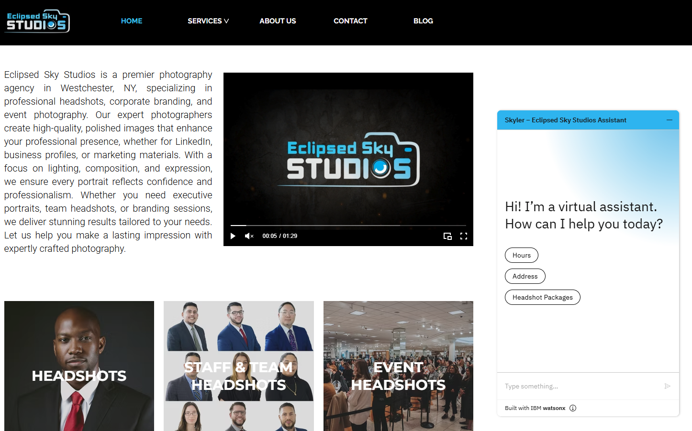
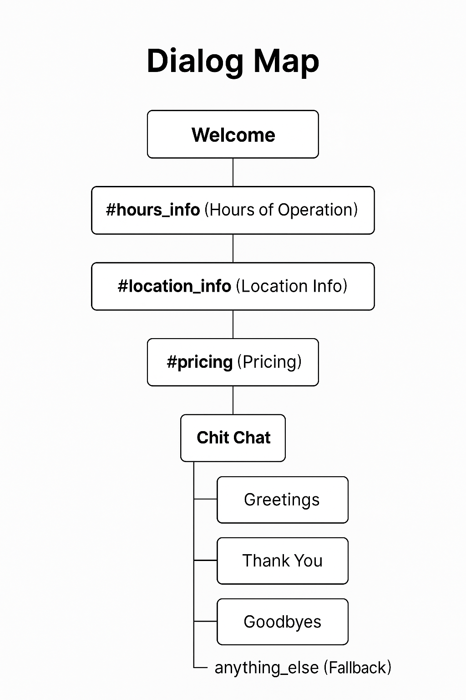

# Eclipsed Sky Studios Chatbot

A custom AI-powered website assistant built with IBM Watson Assistant to support photography clients on the Eclipsed Sky Studios website.

## 🧠 Features

- 💬 **Greeting** – Welcomes site visitors warmly
- 🕒 **Studio Hours** – Provides accurate operating times
- 📍 **Directions** – Shares studio address & how to get there
- 💸 **Pricing Info** – Explains headshot packages and pricing

## 🛠️ Built With

- **IBM Watson Assistant**
  - Dialogs (intents, entities, and dialog nodes)
  - Multi-turn conversation handling
- Integrated into a website via Watson Assistant web chat embed

## 🧭 Dialog Flow

The assistant follows a structured flow:
1. Welcome Node
2. Intent Recognition
   - `#hours`, `#pricing`, `#directions`
3. Routes to matching Dialog Nodes
4. Fallback Node (`#anything_else`) for unrecognized input

## 🧪 Sample Questions

- “What are your hours?”
- “How much are headshots?”
- “Where is your studio?”

## 📎 Screenshots

See `/screenshots/` folder for:
- Chatbot UI on homepage
- Backend dialog tree view

---

## 📂 Folder Structure

